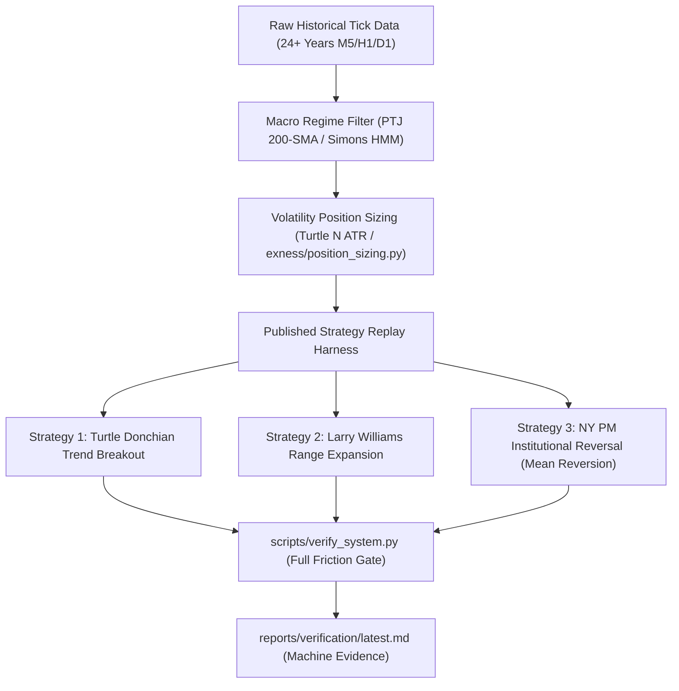

# The World-Class Trader Blueprint & Published Strategies

**KSM Institutional Quantitative Research**  
*A complete departure from retail illusions toward audited, institutional-grade market mechanics.*

---

## 1. The Core Paradigm Shift: Retail Fantasy vs. Institutional Reality

Every trader begins with retail concepts: searching for a 80%–90% win-rate system, scalping for tiny targets (0.6R), and believing that being "right" on candle patterns is the secret to wealth. 

Our 24-year empirical tests on raw tick data have definitively proven what professional fund managers have known for decades:
- **Intraday Transaction Drag**: Spreads and slippage act as a fixed toll. When you risk $1.0\text{R}$ to make $0.6\text{R}$, you need a $>63\%$ win rate just to cover broker costs.
- **The Inevitable Outlier Loss**: A single widened spread during news or execution slip on a micro-stop erases 4 to 5 winning scalps.
- **The Institutional Law**: Real wealth in trading is generated through **asymmetric payoffs** (making $3\text{R}$ to $10\text{R}$ when right), **strict volatility position sizing**, and **ruthless risk defense**.

---

## 2. The Titans: Philosophy, Verified Records & Core Rules

### 1. Jim Simons & Renaissance Technologies (The Quantitative King)
* **Audited Track Record**: The Medallion Fund produced **66% annualized returns** before fees from 1988 to 2018 ($100B+ net profit).
* **Core Philosophy on Win Rate**:
  > *"We're right 50.75 percent of the time… but we're 100 percent right 50.75 percent of the time. You can make billions that way."* — Robert Mercer, co-CEO of Renaissance
* **Published Scientific Foundations**:
  * **Hidden Markov Models (HMM)**: Markets switch between distinct mathematical regimes (high-volatility expansion, low-volatility drift, mean-reverting chop). Algorithms must identify the regime before choosing an execution archetype.
  * **Friction-Adjusted Execution**: Simons noted that early models lost money because they ignored market impact. Medallion’s true edge was rigorous modeling of the bid/ask spread and order book depth.

---

### 2. Paul Tudor Jones (Tudor Investment Corp — The Asymmetric Macro Titan)
* **Audited Track Record**: Predicted the 1987 crash; 40+ years of positive compounding across global macro markets.
* **Core Philosophy on Risk-to-Reward**:
  > *"5:1 (risk/reward). Five to one means I'm risking one dollar to make five. What five to one does is allow you to have a hit ratio of 20%. I can actually be a complete imbecile. I can be wrong 80% of the time, and I'm still not going to lose."*
  > *"Don't focus on making money, focus on protecting what you have. I'm always thinking about losing money as opposed to making money."*
* **Published Rule: The 200-Day Moving Average Filter**:
  * In Tony Robbins' *Money: Master the Game*, PTJ shared his core defensive rule:
  * **The Rule**: Always monitor the 200-day Simple Moving Average (SMA). If price is below the 200-day SMA, long positions are strictly forbidden. Only trade in the direction of the multi-month macro trend.

---

### 3. Stanley Druckenmiller & George Soros (The Asymmetric Conviction Titans)
* **Audited Track Record**: 30-year track record averaging ~30% annually with **zero losing years**.
* **Core Philosophy on Expectancy**:
  > *"It's not whether you're right or wrong that's important, but how much money you make when you're right and how much you lose when you're wrong."* — George Soros (cited by Druckenmiller)
  > *"When you have tremendous conviction on a trade, you have to go for the jugular."* — Stanley Druckenmiller
* **The Takeaway**:
  * Hit rates of top macro traders are usually **45% to 52%**.
  * Profits do not come from day-to-day scalping; they come from identifying a structural market imbalance, risking a defined $-1\text{R}$, and riding the winner into explosive multi-R payoff.

---

### 4. The Turtle Trading System (Richard Dennis & William Eckhardt — 100% Published)
* **The Historical Experiment (1983)**: Richard Dennis recruited 23 novices and taught them a mechanical trend-following system. In 5 years, the Turtles earned **$175,000,000+**.
* **The Win Rate Reality**:
  * **Win Rate**: Only **35% to 45%** (as published by Curtis Faith in *Way of the Turtle*).
  * Most trades were small $-1\text{R}$ whipsaws. The entire annual return came from 3 or 4 monster trends that ran for $+8\text{R}$ to $+15\text{R}$.
* **Exact Published Mechanical Rules**:
  1. **Volatility Measurement ($N$)**:
     $$TR = \max(\text{High} - \text{Low}, |\text{High} - \text{Close}_{\text{prev}}|, |\text{Low} - \text{Close}_{\text{prev}}|)$$
     $$N = \frac{19 \times N_{\text{prev}} + TR}{20} \quad (\text{20-period Exponential ATR})$$
  2. **Position Sizing (The Unit)**:
     $$\text{Unit Size} = \frac{0.01 \times \text{Account Equity}}{N \times \text{Dollar Point Value}}$$
     Every trade risks exactly 1% of account equity per Unit.
  3. **System 1 (Short-Term)**:
     - **Entry**: Buy on 20-day High breakout; Sell Short on 20-day Low breakdown.
     - **Filter**: Skip breakout if the previous 20-day breakout was a winning trade.
     - **Exit**: 10-day low (for longs) or 10-day high (for shorts).
  4. **System 2 (Long-Term)**:
     - **Entry**: Buy on 55-day High breakout; Sell Short on 55-day Low breakdown (all breakouts taken).
     - **Exit**: 20-day low (for longs) or 20-day high (for shorts).
  5. **Stop Loss**: Hard stop placed at exactly $2N$ (2 ATRs) below entry (maximum loss capped at 2%).
  6. **Pyramiding**: Add 1 Unit every $0.5N$ price moves into profit, trailing the stop for all units upward to $2N$ behind the latest entry (max 4 Units).

---

### 5. Larry Williams (World Cup Championship Record Holder)
* **Audited Track Record**: Turned **$10,000 into $1,147,000 in 12 months** (1987 World Cup Championship).
* **Published Books**: *Long-Term Secrets to Short-Term Trading*.
* **His Direct Opinions on Intraday Trading**:
  * Intraday 1m/5m scalping is a tax paid to the broker.
  * Markets expand from periods of low volatility into high volatility.
* **Published Volatility Expansion Strategy**:
  $$\text{Long Trigger} = \text{Open} + (K \times \text{Range}_{\text{prev}})$$
  $$\text{Short Trigger} = \text{Open} - (K \times \text{Range}_{\text{prev}})$$
  Where $K \in [0.50, 0.70]$ and $\text{Range}_{\text{prev}} = \text{High}_{\text{prev}} - \text{Low}_{\text{prev}}$.

---

### 6. Cliff Asness & AQR Capital Management (Century-Long Empirical Evidence)
* **Audited Research**: Over 100+ years of cross-asset data published in peer-reviewed journals (*Value and Momentum Everywhere*).
* **Empirical Fact**:
  * Only two phenomena reliably beat transaction costs over multi-decade out-of-sample data:
    1. **Time-Series Momentum**: Markets that trend continue trending over 1-to-12 month horizons.
    2. **Value Reversion**: Extreme asset deviations mean-revert over multi-year horizons.
  * Micro intraday patterns on un-gated 5-minute candles exhibit near-zero edge after real execution spreads are deducted.

---

## 3. Systematic Implementation Plan for ksm-institutional-quant

We are realigning our quantitative pipeline to test and execute these proven models:

1. **Test the Published Turtle System**: Resample M5 data to Daily/H4 bars and simulate the exact Turtle System 1 and System 2 rules across our 24-year Forex datasets under real spreads and slippage.
2. **Test the Larry Williams Range Breakout**: Evaluate daily volatility expansion entries on GBPJPY, EURJPY, and XAUUSD.
3. **Keep the Only Positive SMC Archetype**: Retain `NY_PM_REVERSAL` (the only positive setup in our claim gate at $+0.032\text{R}$) as an intraday mean-reversion component.
